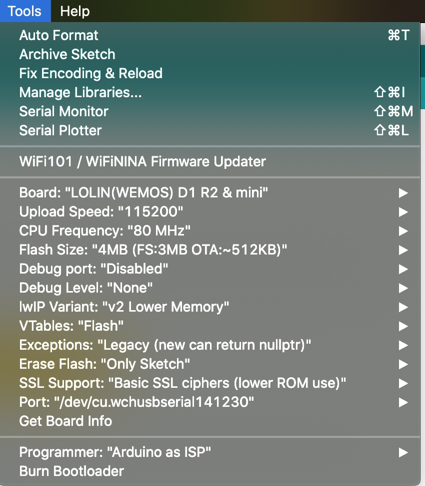
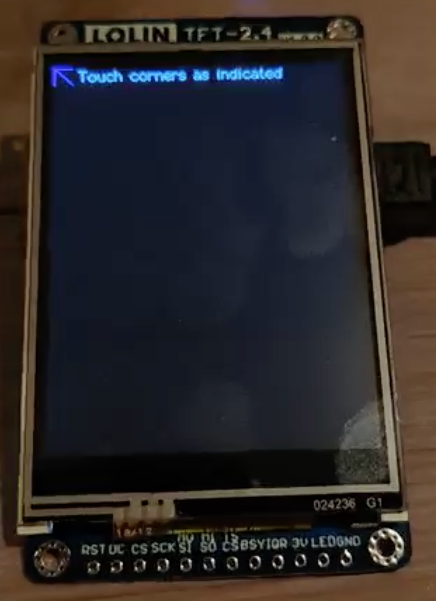
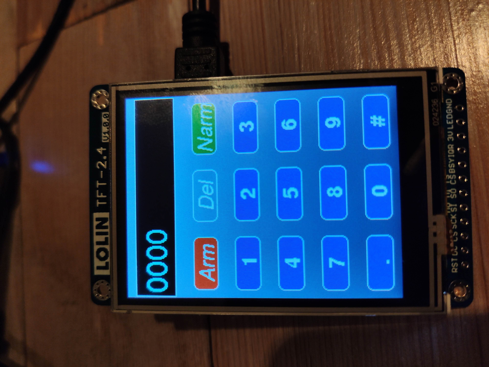

# WMAP
Wemos Mqtt Alarm Panel

This is still very much Work in Progress, but I need something to push my code to :) 

Reach out to me for questions or sugestions:


Or star this repo:


Thing in action:
[My Twitter post](https://twitter.com/Patatman1/status/1206922401486966786)


## Bill Of Materials (BOM)
 - Wemos D1 Mini (can also work with others, haven't tested yet)  (around 3$)
 - Lolin 2.4 TFT display (I got mine from: [AliExpress](https://www.aliexpress.com/item/32919729730.html?spm=a2g0s.9042311.0.0.4d934c4dD13Gtj)) (around 6$)
 - Micro USB cable (you probably already have some)

Total costs Hardware: 9$
Let's keep it on the high side, and imagine you have to pay extra for shipping: 15$! 
That's really not much for a pretty awesome solution like this. 

## Software
You'll need the Arduino software suite, and the following libraries:
TFT_eSPI [Found here](https://github.com/Bodmer/TFT_eSPI)
PubSubClient [Found here](https://pubsubclient.knolleary.net/index.html)
Or you can install them using the Arduino Library Manager.

You'll also need the ESP8266 boards, from the boardsmanager [or this github link](https://github.com/esp8266/Arduino)

If you're already lost by now, I recommend reading up some Arduino basics and doing some small sample projects. If something is unclear regarding this tutorial, please let me know (my contact info is at the top and bottom of this readme) or create a PR so we can make it better together. 

# Getting started

## Preperation
First, we need to setup the TFT_eSPI library to fit our needs.
The library can be found in your documents folder on OSX. (~/Documents/Arduino/libraries/TFT_eSPI)
I'm not sure where it is on Windows (sorry)
I needed to adjust the `User_Setup_Select.h`, `User_Setup.h` and the `Users_Setups\Setup1_ILI9341.h`

### In the `User_Setup_Select.h`:
Around line `24`, you need to uncomment:
```
#include <User_Setups/Setup1_ILI9341.h>  // Setup file configured for my ILI9341
```

### In the `Users_Setup.h`:
Around line `19`, you need to uncomment:
```
#define ILI9341_DRIVER
```

And around line 128:
```
// For NodeMCU - use pin numbers in the form PIN_Dx where Dx is the NodeMCU pin designation
#define TFT_CS   PIN_D8  // Chip select control pin D8
#define TFT_DC   PIN_D3  // Data Command control pin
#define TFT_RST  PIN_D4  // Reset pin (could connect to NodeMCU RST, see next line)
//#define TFT_RST  -1    // Set TFT_RST to -1 if the display RESET is connected to NodeMCU RST or 3.3V

//#define TFT_BL PIN_D1  // LED back-light (only for ST7789 with backlight control pin)

#define TOUCH_CS PIN_D3     // Chip select pin (T_CS) of touch screen
```

### In the `Users_Setups\Setup1_ILI9341.h`:
Around line `6` you need to adjust the pins to match yours. In my case:
```
#define TFT_CS   PIN_D0  // Chip select control pin D8
#define TFT_DC   PIN_D8  // Data Command control pin
#define TFT_RST  PIN_D4  // Reset pin (could connect to NodeMCU RST, see next line)
//#define TFT_RST  -1    // Set TFT_RST to -1 if the display RESET is connected to NodeMCU RST or 3.3V
```
This is working for the Lolin 2.4 TFT with ILI9341 driver.

## Flashing 
In order to flash, you need to copy all the code from `wmap.ino` in this repo and open it with the Arduino software.
If you have the Wemos D1 connected, make sure you have the right board settings. In my case:


Once it's flashed, a calibration screen will pop-up.
If you do this, it will save the calibration settings (unless specified otherwise in the code). But for most users 1 time is enough (or reflash)
Afterwards it will boot and display the touch panel, once signed on it will publish a package to the MQTT broker and report the status.

## Calibration:


## alarm panel:



